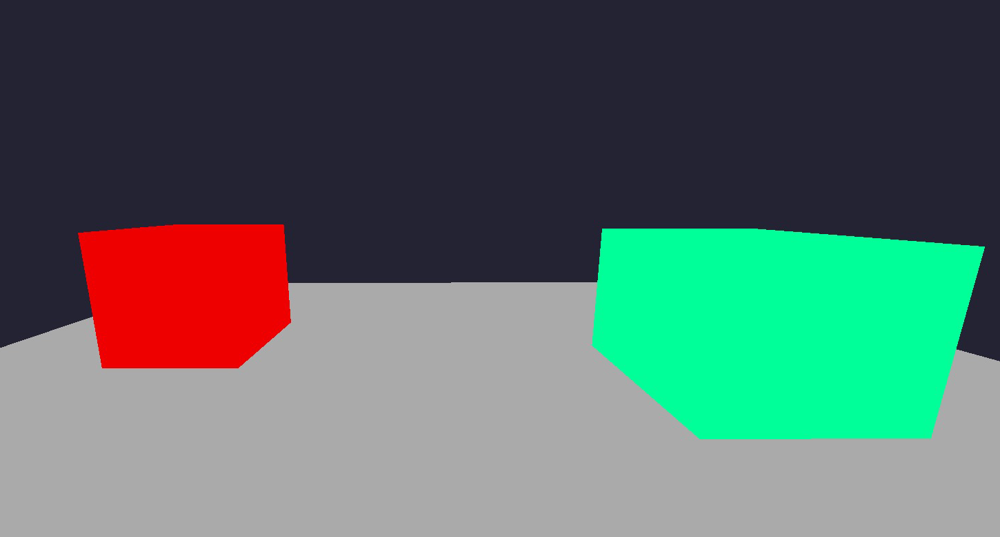
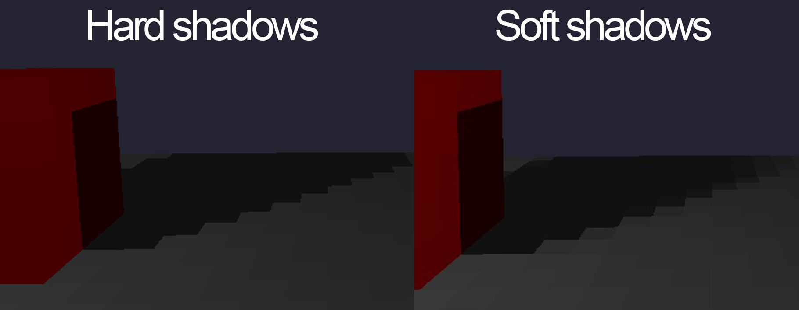

<BR>


# Introduction

This article covers the fundamentals of building and rendering a 3D grid of voxels with per voxel lighting effects. Expect this to be beginner friendly with a decent but not perfect next gen output at the end. I will cover the principles behind this "per voxel" idea, while also mentioning areas of improvement if you are interested in doing extra reserach on other features or implementations for better results. This should be easy to follow along regardless of what graphics API you choose, for my examples I will showcase OpenCL, since this is what I used for this project, but you can feel free to follow along with something else. 

# Storing the voxels
## But what is a voxel? 
Voxels are our cubes in the scene and we can think about them like 3D pixels.
We can declare voxels simply by using two float4 or float3 (let's go with the first option because it might help with memory aligment later and extra storage variables might come in handy). We don't really need a position for a voxel since we are going to use a grid, but we surely need a way to express how that voxel looks. The first float is for the base color, and the second one will hold the lighting color. I will also use the 4th member of the first float4 to store the status of that voxel. One representing a solid voxel and zero an empty space.
```cpp
typedef struct {
  float4 color;//base color
  float4 extra;//used for color evaluation
} Voxel;
```

Not having a position for each voxel might sound odd, but we can use this very basic formula to acces each voxel by determining an index using our iterators while looping trough the grid.
```cpp
int x, y, z; 
int GRID_SIZE = 64;

int index = x + y * GRID_SIZE + z * GRID_SIZE * GRID_SIZE;
```

Before rendering and playing with cool light effects we need a way to store our voxels. Let's aim for a fixed 64x64x64 grid. For what we aim at the end, this offers enough space for some decent test scenes and will not impact performance that much.

The easiest way to store this, is a simple C style array of voxels. There are other methods out there, that are more complicated and have more performance but this is enough for now.
```cpp
Voxel grid[GRID_SIZE * GRID_SIZE * GRID_SIZE]
```


# Rendering voxels
## Plotting pixels
We will make good use of something that has become really popular in the last couple of years: RAY-TRACING, ray marching to be more precise. 

The basic idea is to have some code execute for each pixel so we can draw something. Ray marching comes into play so we can determine if that pixel is supposed to represent a part of one of our voxels or not.

Now let's take a step back and understand what is ray tracing, ray marching and how we can use this here to get nice performance and results. Both ray marching and ray tracing are ways to determine an intersection between a ray and something we define (usually by some mathematical formuals). The difference between the two is how the ray is being shot in the scene. Ray tracing is straight to the point(and traced back to simulate light propagation), yields nicer looking results but is slower. Ray marching will gradually step into the scene step by step until it hits something (we can trace this one back too).
We care more about performance and simplicity in this project so ray marching will be the way to go. This being said, we want to have rays for each pixel on the screen, marching forward to see what we hit so we color each pixel accordingly.

We can define a ray like this:
```cpp
typedef struct {
  float3 origin;
  float3 direction;
} Ray;
```

And we setup our rays to shoot from the camera like this:
```cpp
float aspectRatio = (float)width / (float)height; // screen sizes

//normalizing pixel coordinates
float normalizedX = (2.0f * x / width) - 1.0f;
normalizedX *= aspectRatio;
float normalizedY = (2.0f * y / height) - 1.0f;

//Calculate ray direction
Ray ray ;
ray.origin = camera.position;
ray.direction = (float3)(normalizedX, normalizedY, 1.0f);

//We can also use camera rotation if we combine the view matrix
//      of the camera with the direction we just made
```


##  Fast Voxel Traversal Algorithm 
We are going to use the Fast Voxel Traversal Algorithm for our ray marching technique. Being fast and reliable, this algorithm is specifically designed for traversing grids and it will represent the sweet spot of our project. You may find people refering to it as DDA (Digital Differential Analyzer) algorithm.

#### How does the basic principle of DDA works?

We evaluate how much the ray travels on each axis inside the voxel and we determine which voxel comes next based on the shortest axis traversed and the direction of it. This is important so we don't skip by mistake cells. We march using this method while checking at each step if the current voxel is empty or not. (voxel.color.w as we decided earlier).
<a href="https://www.youtube.com/watch?v=NbSee-XM7WA&t=412s">Check this tutorial for DDA with a great visual example</a>

You can find a more in depth explanation on this <a href = "https://github.com/cgyurgyik/fast-voxel-traversal-algorithm/blob/master/overview/FastVoxelTraversalOverview.md">here</a>. This is a brief outline of the algorithm:
```cpp
//initialization for the first step
for (int i = 0; i < 3; ++i) 
{
    //determine how much we should move in each direction
    step[i] = (ray.direction[i] > -FLT_MIN) - (ray.direction[i] < -FLT_MIN);
    float nextBoundary = (float)(floor(ray.origin[i]) + (step[i] > 0) );
    tMax[i] = (nextBoundary - ray.origin[i]) / ray.direction[i];
    tDelta[i] = 1.0f / fabs(ray.direction[i]);
}

while (true) 
{
    //........

    //what's next?
    if (tMax.x < tMax.y && tMax.x < tMax.z) 
    {
        currentCell.x += step.x;
        tMax.x += tDelta.x;
        //maybe pick a normal too?
        //normal = (float3)(-step.x, 0.0f, 0.0f);
    } else if (tMax.y < tMax.z) {
        currentCell.y += step.y;
        tMax.y += tDelta.y;
    } else {
        currentCell.z += step.z;
        tMax.z += tDelta.z;
    }

    //What if we hit something?
    //Check if the grid holds something in there or not
    //If there is a solid voxel we can say that we hit something
    if (currentCell.x >= 0 && currentCell.x < GRID_SIZE &&
            currentCell.y >= 0 && currentCell.y < GRID_SIZE &&
            currentCell.z >= 0 && currentCell.z < GRID_SIZE) {
            
            int indexGrid = currentCell.z * GRID_SIZE * GRID_SIZE +
                            currentCell.y * GRID_SIZE + currentCell.x;
            if (grid[indexGrid].color.w == 1.0f) {
                // Hit a non-empty voxel, we return the index
                return indexGrid; 
            }
    }
}
```
Now that we can traverse the grid, we can easily determine if a point is inside a voxel or not, giving us the ability to color that pixel based on our world of voxels
```cpp
int hitIndex = march_ray(ray, grid);
if (hitIndex != -1) {
    
    //this is voxel, let's make it white!
    pixelBuffer[index + 0] = 255.0f; // Red
    pixelBuffer[index + 1] = 255.0f; // Green
    pixelBuffer[index + 2] = 255.0f; // Blue

    //or lets's the voxel color
    pixelBuffer[index + 0] = grid[hitIndex].color.x; // Red
    pixelBuffer[index + 1] = grid[hitIndex].color.y; // Green
    pixelBuffer[index + 2] = grid[hitIndex].color.z; // Blue

} else { //background
    pixelBuffer[index + 0] = 0.0f; // Red
    pixelBuffer[index + 1] = 0.0f; // Green
    pixelBuffer[index + 2] = 0.0f; // Blue
}
```

# Make them look good
If you followed everything so far you could have something like this.



This is already quite impressive but I know we are all here for the cool per voxel effects so let's dive in this topic now.

# Per Voxel instead of Per pixel
The main difference between the two aprroaches is performance and looks in the end. 
For doing lighting per pixel we would follow the regular ray tracing principles and use the kernel/shader we already made in the previous step, since this is already capable of computing code for each pixel on the screen. 
However, we want the nice stylized and blocky effect instead. We can achieve this by having a separate kernel or shader depending on what API you are using that will run some code for each voxel in the scene instead of each pixel on the screen. This is basically a better version of a for loop that will run on our GPUs.

Here is an example on how to acces the voxels with this approach. This is in OpenCL kernel but it will be similar in others envirnoments.

```cpp
int x = get_global_id(0);
int y = get_global_id(1);
int z = get_global_id(2);

int index = x + y * GRID_SIZE + z * GRID_SIZE * GRID_SIZE;

//voxel
grid[index]//read or modify its values
```

Just to put into perspective, let's say we need to calculate some lighting in our scene. For the sake of this example let's assume that the calculation for this lighting is exactly the same in a per pixel method as well as on a per voxel method. Now let's think about how many of those calculation we would do in each scenario. 

Usually the most common resolution for a monitor is Full HD (1920x1080), this results in 2.073.600 pixels, thus that many calculations. Our scene, as we established in the begining, is 64x64x64 voxels, which means we only do 262.144 calculations (worst case scenario where the entire grid is filled)
And we get the stylized effect that we all love on top of all that performance.

# Lighting
We need a way to store the lights and we can simply declare a struct like this.
```cpp
typedef struct
{
    float4 color;
	float4 pos;
}Light;
```
Same memory talk as the voxels and I am going to use the 4th member of color to store the light intensity.
We can evaluate the light level based on the distance between the voxel and the light source. Add some attenuation and intensity and we have some light evaluated that we can store in that extra float4.

```cpp
float3 lightCell = floor(lights[i].pos.xyz);

float3 voxelPos = (float3)(x, y, z);
float dst = distance(voxelPos, lightCell);

float intensity = lights[i].color.w; // Increase for more powerful light
float attenuationFactor = 0.008f; // Decrease for less attenuation
float attenuation = 1.0f / (1.0f + attenuationFactor * dst * dst);
float3 lightCol = lights[i].color.xyz; // Color of the light

grid[index].extra.xyz =  lightCol * attenuation * intensity 
// this is the light calculation, maybe store in the extra now

```
We can now change the pixel kernel to take this into consideration.

```cpp
finalColor = grid[hitIndex].color.xyz * grid[hitIndex].extra.xyz;
pixelBuffer[index + 0] = finalColor.x; // Red
pixelBuffer[index + 1] = finalColor.y; // Green
pixelBuffer[index + 2] = finalColor.z; // Blue
```

We can now admire lighting per each voxel


# Shadows
To complete our light system we should have some shadows in the scene to give our world more credibility. This is not hard at all, actually, we already have everything we need to implement shadows. In order to do this we need to see if there is anything between the light and the voxel. Let's use our ray marching algorithm from above to traverse the grid from the voxel to the light and see what we hit.

```cpp
 // Shadows
Ray shadowRay;
shadowRay.direction = normalize(lightCell - voxelPos);
shadowRay.origin = (voxelPos+0.5f) + shadowRay.direction * (2.5f );
int hit = march_ray(shadowRay, grid);

if (hit == -10) {
    // The ray hit the light source directly, no shadow
    shadowMultiplier = 1.0f;
} else if (hit != -1) {
    // We hit something so here is shadow
    shadowMultiplier = 0.005f;  
    //not 0 so it's not pitch black
} else {
    // No hit, full illumination
    shadowMultiplier = 1.0f;
}

```

We can multiply this shadow result to our light calculation we had before for the final result
```cpp
grid[index].extra.xyz = lightCol * attenuation * intensity * shadowMultiplier;
```


# Improvements?

The list of improvements could go on forever but for the sake of this article I will keep it short and  quickly describe how to implement only some of the easy ones out there.

## Soft Shadows at a per voxel level?

If we calculate our shadows with a single fixed cell position for our light source we only get hard shadows. To quickly solve this issue we could pick each time a random adjasent voxel around the light source itself(imagine a 3x3x3 area where we pick a cell). This way we get the effect of penumbra since our light is no longer a single point. However, we now notice our voxels flickering and thats because of the random position picked each frame, thus random results each frame; we call this noise. 

```cpp
float3 lightCell = floor(lights[i].pos.xyz);
lightCell = getRandomAdjacentVoxel(lightCell,  seed++); 
```

We could also shoot 27 rays (3x3x3) each time for a light and eliminate the noise problem but this would impact performance.

## Denoising per voxel?

Like regular ray tracing, noise it's an annoying issue; fortunelty there are solutions quite easy to implement. Here are two ideas that you could try,separately or even combine them.

- Instead of using the current frame result for our light calulcations, we can do a weighted average between the current frame result and the last frame, where the last one is more important. This will also give us some latency in our image but we can find a good balance for that weighted average and find a good balance between looks and latency.

```cpp
////....light calculations....
c = lightCol * attenuation * intensity * shadowMultiplier;

oldColor = grid[index].extra.xyz; // previous frame result

// weighted averegate 10% new frame | 90% old frame
float3 result = (0.1f * c + 0.9f * oldColor); 
grid[index].extra.xyz = result; // final output
```

- We can also have a structure that will acumulate all of the light calculation for each voxel (this can be another grid). Each frame we will add the result to the acumulator grid. The image we display is formed by the acumulation color divided by how many frames we have acumulated. Keep in mind that we need to reset the frame counter when we move something in the world otherwise it will take a long time to see the change on the screen.

```cpp
////....light calculations....
c = lightCol * attenuation * intensity * shadowMultiplier;

acumulatorGrid[index].extra.xyz += c; // add result to acumulator
grid[index].extra.xyz = acumulatorGrid[index].extra.xyz / (float)frameIndex; // final output
```

# Closing remarks


This article showcased the amazing posibilities with voxels and really simple algorithms and ideas. We laid the foundation for a possible interesting future project and from now on, the sky is the limit, reflections, global ilumiantions, you name it!

If you followed this article or at least found it interesting, I strongly encourage you to take a look at the following:
- https://jacco.ompf2.com/2021/02/01/a-voxel-renderer-for-learning-c-c/ 
- Octress and voxel engines
- Ray tracing
- Teardown devtalk


